# ReTool

ReTool is a prototype tool for automatically updating and reusing existing test cases when facing regulation changes. It is the official implementation for paper "[Cascading Effect-Aware Reuse of Conformance Test Suites Under Rapidly Evolving Regulations]()". This paper presents a two-phase automated approach for reusing test suites from natural language regulatory rule changes, guided by the cascading effect. Phase I automatically models the cascading dependencies by constructing the regulatory rules-test scenario-test case relation graph from existing testing histories, and aggregates test cases into test suites accordingly. Phase II then performs a cascading effect analysis based on the rule-scenario test case relation graph, analyzing changes in scenarios to determine reusable test suites and update the affected test suites accordingly. Experiments show that it outperforms state-of-the-art LLMs like Grok-k and GPT-5 on the quality of the updated test cases, the test case reuse rate, and the test efficiency.

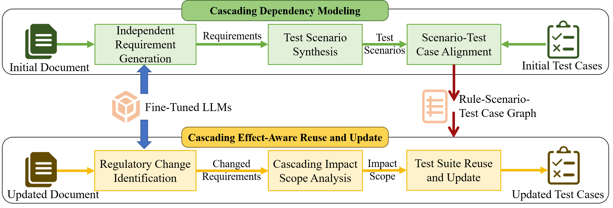


## Data Available
    The anonymized code, constructed regulatory corpus, fine-tuned LLMs, and technical report:
    Code: https://github.com/AnonymousAuthorsForFSE2026/ReTool
    Corpus: https://github.com/AnonymousAuthorsForFSE2026/ReTool/tree/master/data/data_for_LLM_decoder
    LLM：https://huggingface.co/AnonymousAuthorsForFSE2026/ReTool
    Technical Report: https://github.com/AnonymousAuthorsForFSE2026/ReTool/tree/master/ReTool_TR.pdf


## 1 Installation

### 1.1 Install step-by-step

All scripts are designed for and run on ***Ubuntu 22.04***.

1. Install dependencies.

    ```bash
    sudo apt update
    sudo apt upgrade -y
    sudo apt install build-essential zlib1g-dev libbz2-dev libncurses5-dev libgdbm-dev libnss3-dev libssl-dev libreadline-dev libffi-dev
    sudo apt-get install -y libgl1-mesa-dev
    sudo apt-get install libglib2.0-dev
    sudo apt install wget
    sudo apt install git
    ```

2. Install miniconda.

    ```bash
    cd ~
    wget https://repo.anaconda.com/miniconda/Miniconda3-latest-Linux-x86_64.sh
    bash Miniconda3-latest-Linux-x86_64.sh
    source ~/.bashrc
    ```

3. Create a virtual python environment and install all the required dependencies.
    ```bash
    git clone https://github.com/AnonymousAuthorsForFSE2026/ReTool.git
    cd ReTool
    conda create -n ReTool python=3.9
    conda activate ReTool
    pip install -r requirements.txt

    # Install flash-attention based on your CUDA version. For example:
    wget https://github.com/Dao-AILab/flash-attention/releases/download/v2.5.6/flash_attn-2.5.6+cu118torch2.0cxx11abiFALSE-cp39-cp39-linux_x86_64.whl
    pip install flash_attn-2.5.6+cu118torch2.0cxx11abiFALSE-cp39-cp39-linux_x86_64.whl
    
    pip install -e .
    ```

4. Download the trained LLMs.
    ```bash
    mkdir model
    mkdir model/pretrained
    mkdir model/trained
    git lfs install
    git clone https://huggingface.co/AnonymousAuthorsForFSE2026/ReTool
    cp -r ReTool/* model/trained/
    rm -rf ReTool

    cd model/pretrained
    git clone https://huggingface.co/THUDM/glm-4-9b-chat
    cd ../..
    ```

5. Run a test demo.
    ```bash
    cd reuse
    python update_testcase.py
    ```
After the command finishes running, the updated test cases are saved at **cache/new_testcase.json**.


## 2 Usage
We provide a streamlined interface, using commands to generate updated test cases for the updated document based on the initial document and initial test cases:

```bash
cd ours
python update_testcase.py --old_file {old_file} --old_testcases {old_testcases} --new_file {new_file} --new_testcases {new_testcases}
```

where {*old_file*} is the path of the initial regulation document, {*old_testcases*} is the path of the initial test case base, {*new_file*} is the path of the updated regulation document, and {*new_testcases*} is the file to save the output updated test cases.


## 3 Model Fine-Tuning

To fune-tune generative LLMs for structured requirement generation task using LoRA, first download the base model and save it under **model/pretrained**, then use a bash file to set the basic training information and hyperparameters, including the training dataset, the base model path, the output directory, and so on. Then run:

```bash
cd decoder_lora/train_script
nohup bash train_llm_lora.sh {setting_file} >{log_file} &
```

The trained model will be saved under the specified directory.

For example, to fune-tune generative LLMs like GLM-4 for structured requirement generation task using LoRA, first download [GLM-4](https://huggingface.co/THUDM/glm-4-9b-chat) and save it under **model/pretrained/**, then run

```bash
cd decoder_lora/train_script
nohup bash train_llm_lora.sh finance/vars_datav3_glm4.sh >../output/glm4/run_glm4.log &
```

You can refer to *decoder_lora/train_script/finance/vars_datav3_glm4.sh* to see the specified settings. The training information such as loss are saved in *decoder_lora/output/glm4/run_glm4.log*. The trained model are saved at **decoder_lora/output/glm4/best_lora_model_{timestamp}/**. The verification results are saved in *decoder_lora/predict_data/glm4/predict_result_best_lora_model_{timestamp}.json*.


## 4 Exeriment Evaluation

### 4.1 One Click Execution Script for Full Experiment

We provide a unified script to help you generate experimental results for 3 experiments with just one click. The script is set to run in the background, and you can view the results after it completes execution. 

Before running the scripe, you must download all the pretrained models for Experiment III.

```bash
# Assuming you are currently in the root directory of the project
cd model/pretrained
git clone https://huggingface.co/meta-llama/Llama-3.2-1B-Instruct
git clone https://huggingface.co/meta-llama/Llama-3.2-3B-Instruct
git clone https://huggingface.co/Qwen/Qwen1.5-4B-Chat
git clone https://huggingface.co/THUDM/chatglm3-6b
git clone https://huggingface.co/Qwen/Qwen2-7B-Instruct
git clone https://huggingface.co/meta-llama/Meta-Llama-3-8B-Instruct
cd ../..
```

Then run the scripe:

```bash
cd experiment
nohup bash run_experiment.sh >run_experiment.log &
```

You can find the experimental results in **exp1/fig/**, **exp2/fig/**, and **exp3/fig/**. 


### 4.2 Script and Results for Experiment I

We also provide specific script for you to run each of the three experiments. Experiment I is to evaluate the effectiveness of tracing cascading effect and updating test cases. To get the result of Experiment I, run:

```bash
cd experiment/exp1
python generate_result_ours.py
bash run_compute_acc.sh
bash run_compute_bsc.sh
bash run_compute_changed_rule_req_sce.sh
bash run_compute_testsuite_acc.sh
python draw_figure.py
```

The experimental results are saved under **fig/**, including Figure **exp1_precision.png**, **exp1_recall.png**, **exp1_f1.png**, and **exp1_bsc.png**.

> Precision 
> 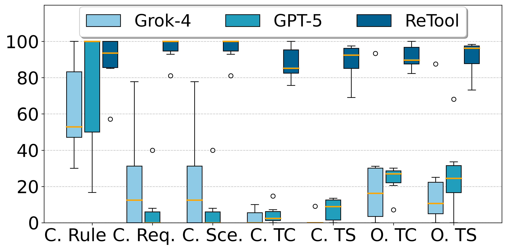

> Recall
> 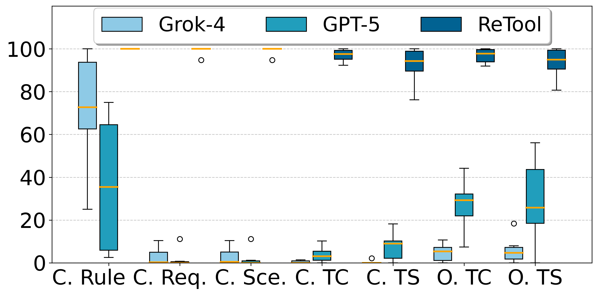

> f1:
> 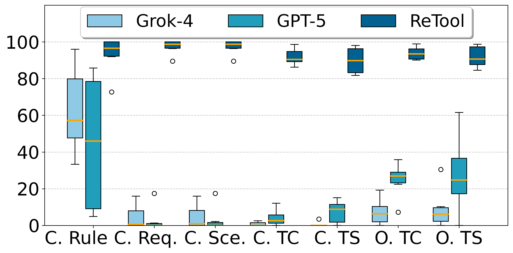

> BSC:
> 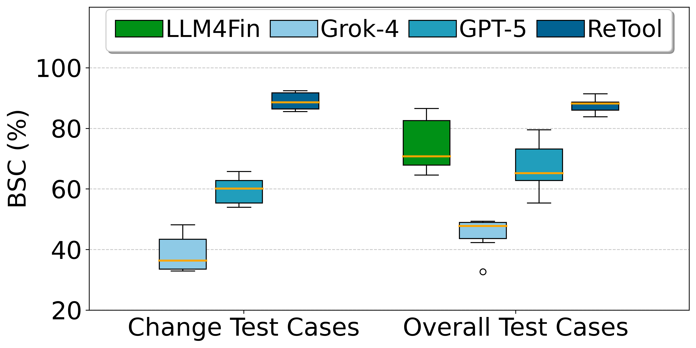


### 4.3 Script and Results for Experiment II

Experiment II is to evaluate the effectiveness of reusing test suites and efficiency gains. To get the result of Experiment II, run:

```bash
cd experiment/exp2
bash run_compute_reuse_acc.sh
python draw_figure_acc.py
python draw_time_table.py
```
The experimental results are saved under **fig/**, including Figure **exp2_testcase_f1.png** and **exp2_testsuite_f1.png**.

> Test Case F1
> 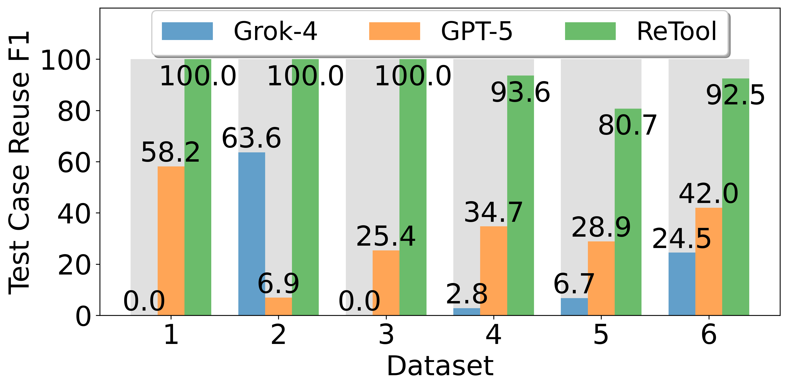

> Test Suite F1
> 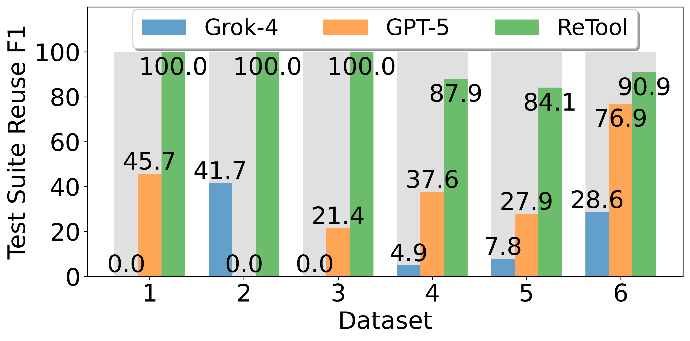


The efficiency evaluation results are saved in Table **exp2_time.csv**.

<table>
<thead>
<tr>
<th rowspan="2">Dataset</th>
<th colspan="4">ReTool</th>
<th colspan="5">LLM4Fin</th>
</tr>
<tr>
<th>G. Time (s)</th>
<th>E. Time (h, with reuse)</th>
<th>E. Time (h, no reuse)</th>
<th>Impr. (%)</th>
<th>G. Time (s)</th>
<th>E. Time (h)</th>
<th>Impr. (%)</th>
</tr>
</thead>
<tbody>
<tr>
<th>1</th>
<th>1882.5</th>
<th>4.3</th>
<th>5.4</th>
<th>20.4↑</th>
<th>19.5</th>
<th>12</th>
<th>79.0↑</th>
</tr>
<tr>
<th>2</th>
<th>1348.7</th>
<th>1.8</th>
<th>3.5</th>
<th>48.6↑</th>
<th>13.9</th>
<th>6.6</th>
<th>67.1↑</th>
</tr>
<tr>
<th>3</th>
<th>1128.3</th>
<th>1.3</th>
<th>2.7</th>
<th>51.9↑</th>
<th>11.5</th>
<th>3.9</th>
<th>58.7↑</th>
</tr>
<tr>
<th>4</th>
<th>1017.9</th>
<th>7.0</th>
<th>14.6</th>
<th>52.1↑</th>
<th>5.7</th>
<th>13.4</th>
<th>45.7↑</th>
</tr>
<tr>
<th>5</th>
<th>1712.9</th>
<th>1.7</th>
<th>7.2</th>
<th>76.4↑</th>
<th>11.5</th>
<th>19.1</th>
<th>88.6↑</th>
</tr>
</tbody>
</table>


### 4.4 Script and Results for Experiment III

Experiment III is to evaluate the impact of LLM capacity on reusing and updating test suites. To get the result of Experiment III, download the pretrained LLMs first:

```bash
cd model/pretrained
git clone https://huggingface.co/meta-llama/Llama-3.2-1B-Instruct
git clone https://huggingface.co/meta-llama/Llama-3.2-3B-Instruct
git clone https://huggingface.co/Qwen/Qwen1.5-4B-Chat
git clone https://huggingface.co/THUDM/chatglm3-6b
git clone https://huggingface.co/Qwen/Qwen2-7B-Instruct
git clone https://huggingface.co/meta-llama/Meta-Llama-3-8B-Instruct
cd ../..
```

Then, run:

```bash
cd experiment/exp3
bash run_generate_result_ours.sh
bash run_compute_acc.sh
python draw_figure.py
```

The experimental results are saved under **fig/**, including Figure **exp3_dataset1.png**, **exp3_dataset2.png**, and so on.
    
> Dataset1
> 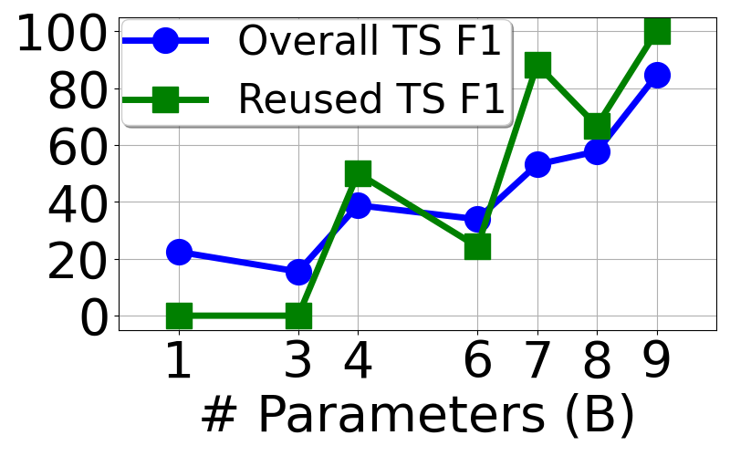

> Dataset2
> 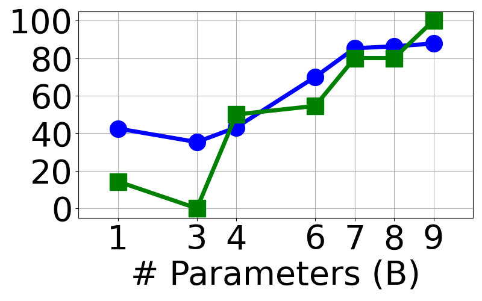

> Dataset3
> 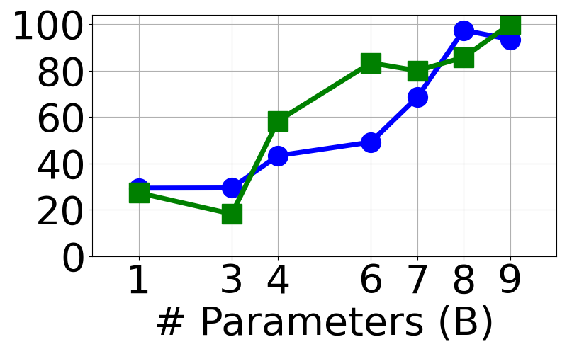

> Dataset4
> 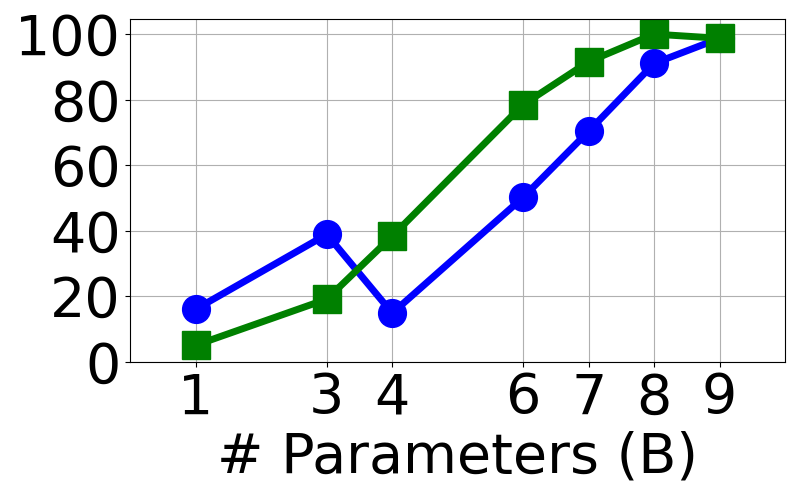

> Dataset5
> 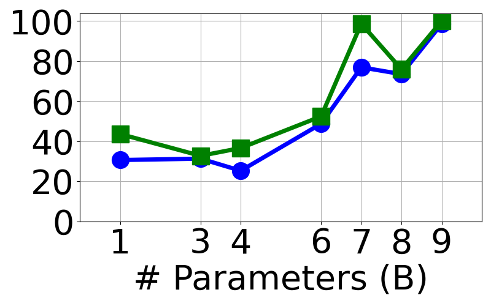

> Dataset6
> 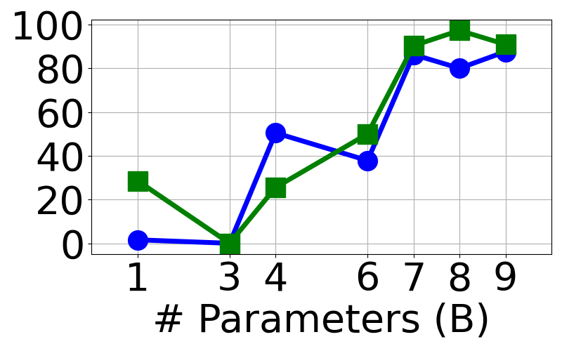


